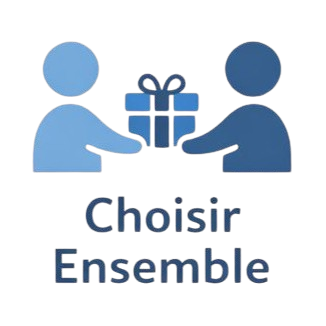

# Jean Dupont

**Développeur Full Stack**  
jean.dupont@email.com | +33 6 12 34 56 78  
[LinkedIn](https://linkedin.com) | [GitHub](https://github.com)

## Expérience Professionnelle

### Développeur Full Stack Senior
**TechCorp** | Paris, France | 2021 - Présent
- Développement d'applications web avec React, Node.js et PostgreSQL
- Mise en place de pipelines CI/CD avec GitHub Actions
- Encadrement d'une équipe de 3 développeurs juniors

### Développeur Web
**WebAgency** | Lyon, France | 2019 - 2021
- Création de sites web responsive avec HTML, CSS, JavaScript
- Intégration d'APIs REST et GraphQL
- Optimisation des performances et du SEO

## Formation

### Master Informatique
**Université de Paris** | 2017 - 2019

### Licence Informatique
**Université de Lyon** | 2014 - 2017

## Compétences Techniques

**Langages**: JavaScript, TypeScript, Python, SQL  
**Frontend**: React, Vue.js, Astro, Tailwind CSS  
**Backend**: Node.js, Express, Django  
**Base de données**: PostgreSQL, MongoDB, Redis  
**Outils**: Git, Docker, AWS, VS Code

## Langues

- **Français**: Langue maternelle
- **Anglais**: Courant (C1)
- **Espagnol**: Intermédiaire (B1)

## Projets & Réalisations

- Développement d'une plateforme e-commerce traitant 10K+ transactions/mois
- Contribution open-source à plusieurs projets populaires sur GitHub
- Speaker à la conférence DevFest 2024